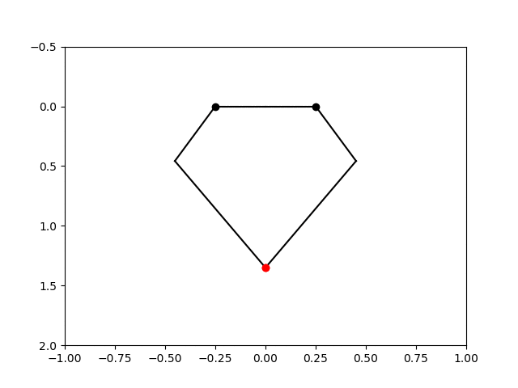
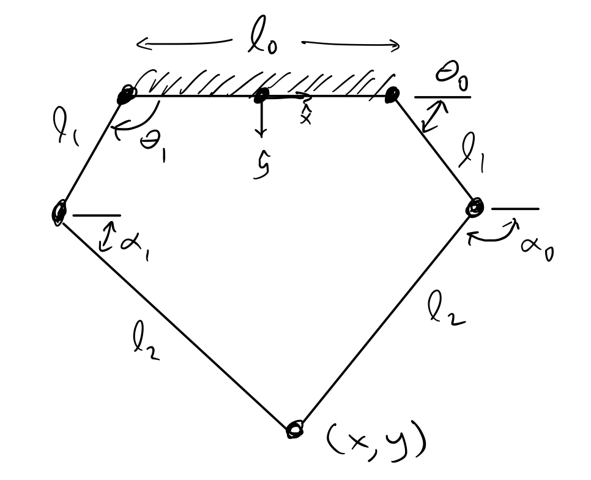

# HW #2

The main goal of this assignment is to implement an inverse kinematics method for our leg so that we can directly command positions for the foot. You will demonstrate your ability to do this by generating an *interesting* trajectory for the foot to trace out. For instance I generated the bat symbol below for my trajectory.



## Deliverables

1. A video of your leg moving along your chosen trajectory. Post this to youtube and include in the end of your Jupyter notebook.
2. A video of the simulated leg moving along the same trajectory. *You can use the provided* ```draw_robot``` *function*.
3. Your completed ```leg.py``` file with the class methods you will implement as part of the assignment.

## Assignment details

### The robot module

As we develop more code for our robot we want to keep it organized in a centralized file structure. If we do this in just the right way Python will treat this file structure as a special _module_ and we can easily import the code we are developing into new python code. I am providing a boilerplate version of this module, it is a folder called ```robot``` (this is the module name). Right now it contains two files, ```___init___.py```, and ```leg.py```. The first file tells python this folder is to be treated as a module, so when we type ```import robot``` python will run whatever code is in ```___init___.py```. In ```___init___.py``` we put a simple import statement to import the ```Leg``` class we will develop, this class will be located in the ```leg.py``` file. 

To use this robot module, _place it in the Odrive/tools/ directory_ and then write your Jupyter notebook in the same directory. This way Python will know where the robot module is defined without having to add it to the python path.

#### The leg class
For controlling our leg we are going to use the object oriented capabilities of Python to develop a leg class (*find out more about classes* [here](http://python-textbok.readthedocs.io/en/1.0/Classes.html)).

A class is basically an entity which contains variables and functions all in one nice compact package. We can then make versions of the class (objects) which store their own variables and can execute the functions of the class. 

For instance, we want to make it easy to do things like remember the home position of the motors, move the motors to a new position, find the current motor positions, then move them home. By implementing a class system we could then do all of this with the following command sequence

```python
myleg = robot.Leg()   # Make a leg object 
myleg.set_home()      # set the current position to be home
myleg.set_joint_pos(90, -45) # move motor0 and motor1
current_position = myleg.get_joint_pos()
myleg.move_home()
```

In the provided module code I have included blank functions that need to be written by you as part of the assignment. These are to be turned in with your videos of the inverse kinematics.

_An important note, after you edit the leg.py file and you want to test it in the jupyter notebook, you need to restart the kernel each time. You can do this through the kernel drop down menu, or typing 0, 0 in sequence._


### Inverse kinematics

We will cover inverse kinematics in depth on Monday in class. However, to get you started what we need to do is first fully define the forward kinematics of the leg which means finding an expression for the foot position (x y) as a function of the two motor angles. This is complicated because three of the joints are unactuated, so we need to do some fancy geometry to solve this problem. _This is step 1_.

For the geometry of the robot let's use the following definitions: 

The 5-bar is defined with parameters 

| Symbol | Parameter | 
|---|---|
|l_0 | Base link | 
| l_1 | Thigh link |
| l_2 | Shin link | 
| \theta_R | Right hip angle | 
| \theta_L | Left hip angle | 
| \alpha_R | Right knee angle |
| \alpha_L | Left knee angle |



After we have the forward kinematics we can compute the Jacobian of the foot position with respect to the motor angles. The symbolic package ```sympy``` will be very helpful for this. _This is step 2_.

Lastly, we need to write our IK solver. There are several ways to do this but we will use a simple iterative solver to compute the IK. I will describe this premise in depth on Monday, but briefly here: We know that inverting the Jacobian and multiplying by a velocity in (x, y) we get values for the joint velocities to move. If we initialize our solver with some random joint angles, we can then figure out where the foot is in this position with respect to where we want to go. This error vector is the direction we want to move so we can multiply it by our inverse jacobian to get motor velocity values that will push us towards the desired endpoint. If we repeat this process sequentially, and take very small steps each time, we will end up at our desired (x, y) location and then we can report back what the joint angles are. We will implement this in the ```Leg``` class. _This is step 3_. 


    